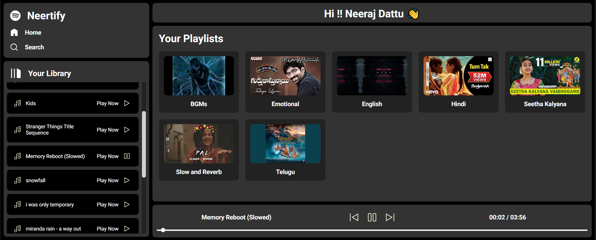
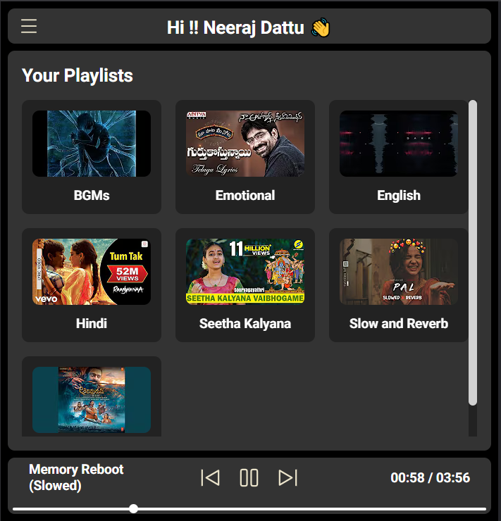
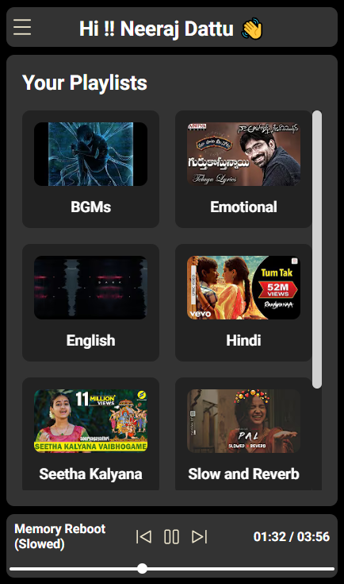
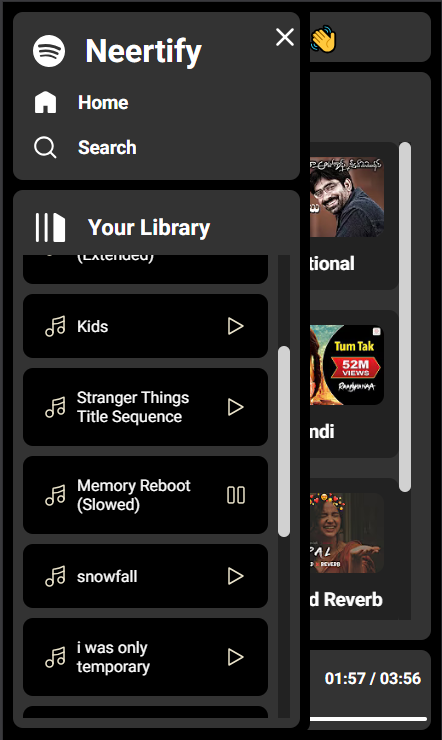
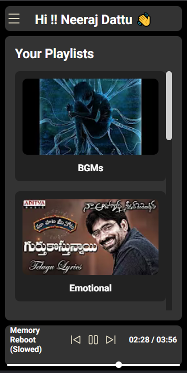
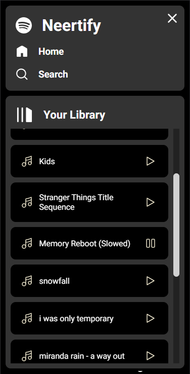

# 🎵 Neertify - Your Personal Music Player Web App

Welcome to **Neertify**, a simple yet elegant music player web application built entirely with **HTML**, **CSS**, and **JavaScript** using a vanilla approach.

🌐 **Access the Web App**: [Neertify](http://neertify.great-site.net/)

---

## 🌟 Features
- **Responsive Design**: Enjoy a seamless experience across all devices.
- **Minimalistic UI**: Clean and user-friendly interface.

---

## 📱 UI Previews on Different Screens

### 🖥️ Desktop

  

### 📱 Tablets

  

### 📱 Mobile

  
  

### 📱 Small Screen Mobiles

  
  

---

---

Feel free to explore and enjoy your music with Neertify! 🎶